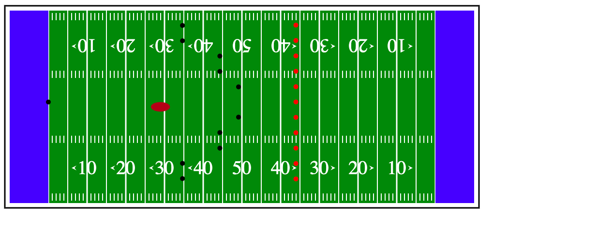
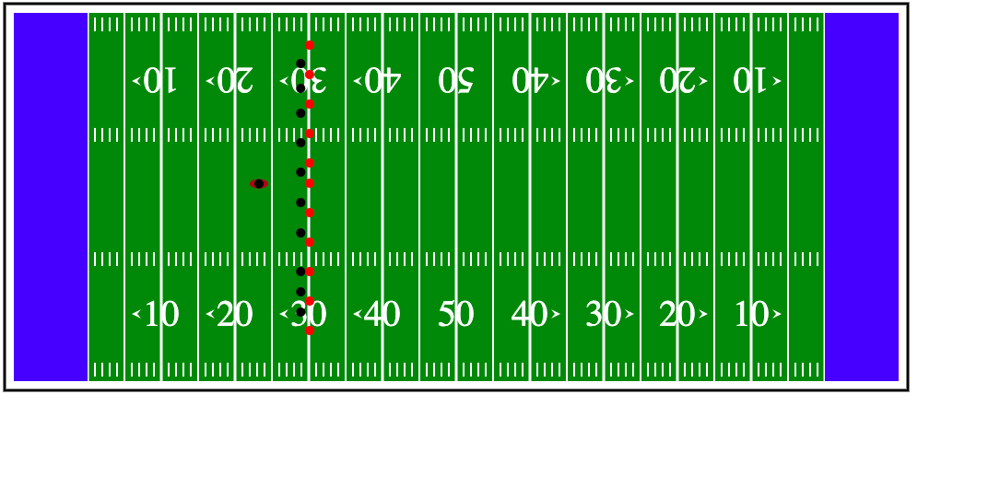

https://mattkiszla.github.io/a1-ghd3/index.html  (refresh page to restart animation)

For this assignment I decideded to make a small football field with animation in it as well which are players (circles) moving around to emmulate a kickoff.

This is the tutorial I mainly looked at to get started. This site also had useful info about other things like transformation, transitions, and animation.

https://www.tutorialspoint.com/d3js/d3js_introduction_to_svg.htm

I also looke at the following links  to help with things like text, rotation, polygons, strok-width and color.
https://stackoverflow.com/questions/15573594/creating-a-border-around-your-d3-graph 
https://stackoverflow.com/questions/11252753/rotate-x-axis-text-in-d3
https://stackoverflow.com/questions/13204562/proper-format-for-drawing-polygon-data-in-d3

Technical Acheivement:
For the the technical acheivement I used transitions to create a small animation sequence of a kickoff on the football field. I believe this goes beyond the base requirements and shows a deeper understanding for this assignment.

Design Acheivement:
For the the designment acheivement I used transformations,translations,rotations to create an accurate image of a football field using various diffrerent shapes and colors. I believe this goes beyond the base requirements and shows a deeper understanding for this assignment.
