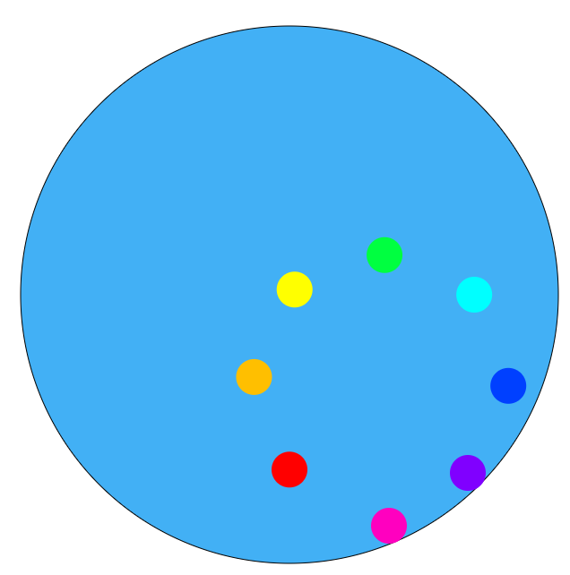
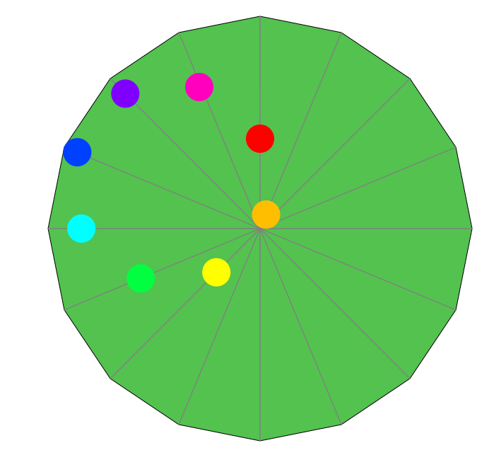

Assignment 1 - Hello World: GitHub and d3
https://andrewsalls.github.io/a1-ghd3/
===


The visualization I created for this assignment

This project recreates an illusion that went viral a few years ago. In the illusion, a series of circles look like they are stuck to the edge of a circle that is rotating around another circle. However, the circles are actually moving back and forth along a line, in a motion that creates a circle shape.

There are two (non-d3) buttons. The first button toggles lines, which helps viewers know for sure that the circles are just moving back and forth along a line.

The second button alters the background, rotating between a circle, a 16-gon, and nothing.


Result of changing the background and toggling the lines

Shapes usage:
 - Circle(s): Background and animation
 - Rectangle: I considered drawing a rectangle between the animated circles, (especially earlier in development when I only had 4 circles), but I assume the goal was to use the ```rect``` element, which would require a lot of calculations to determine the correct rotation. Instead, I added a header with the course and assignment number as svg text (Ignore that this is very easy to do without SVGs)
 - Line(s): Togglable display to show that circles move along a line
 - Polygon: 16-gon as alternate background
 - Different colors: Besides the lines, which are all grey, every shape has a different color

Technical achievement
===
The visualization is animated. The timing of each inner circle's motion is very important, as they have to stay closely synced in order to create the appearance of a larger circle. Otherwise, the motion becomes a mess.

Most online resources say to call the animation in a function, and to loop by using the ```transition.on()``` function. However, I found that this would result in desyncing very quickly. In order to fix this, I needed to start an animation a fixed amount of time after the start of the last animation. That way, animations will automatically resync.

```transition.on()``` only supports running a function right after the animation starts, or right after it ends. To add the delay without overcomplicating things, I switched to a ```setTimout``` loop, where it calls the animation function and then sets a new timout for 250ms later. The new timeout calls the animation for the next circle, so if one of the circles finishes its animation slightly too fast, it will pause for a very small amount of time and then get resynced to be on a 250ms delay again.

Design achievement
===
The base assignment was just to draw some shapes, so I think recreating a relatively well known illusion is an achievement.

I chose to use a rainbow color scheme for the circles to create the effect of a color wheel, emphasizing the circle shape they create. The idea is that a viewer's eye moves along the colors rather then following the path of a single circle, which makes it harder to see that they are moving in a straight line.

The togglable lines are an (admitedly fairly obvious) design choice to help people understand what is actually happening.