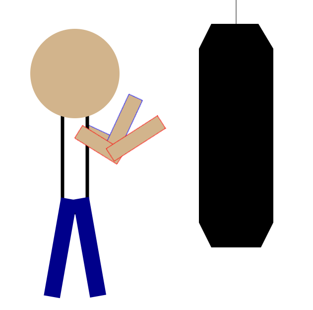
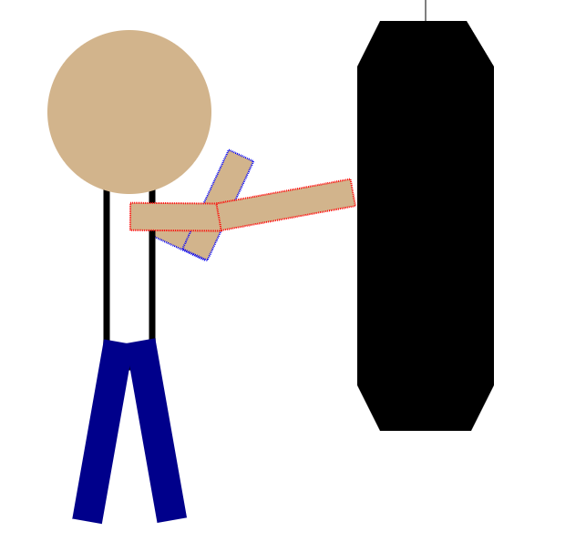

Assignment 1 - Hello World: GitHub and d3  
===

Link to page: https://jamesstaryi.github.io/a1-ghd3/

**Circle:** I used a circle for my characters head.

**Rectangle:** I used rectangles for the arms, body, and legs.

**Polygon:** I used a polygon for the punching bag.

**Line:** I used a line for the punching bag chain.

**Different Colors:** I used different colors to make the character more easily identifiable.

Character default state

Character punching state

Achievements
---
**Technical:** I used a transition animation that is looping between the initial state and the punching state to imitate a punching motion.

**Design:** I arranged the shapes to imitate a person punching a punching bag. I also used stroke and stroke-dasharray to make it easier to differentiate between the character's two arms. I found that having them without the outline is harder to see what is going on.

Sources
---
I used the Professor's D3 and Github demo video to get started with the assignment. From there I used google for minor syntax questions.
