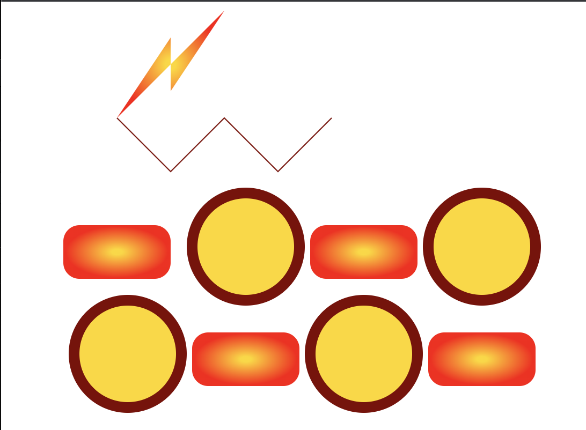
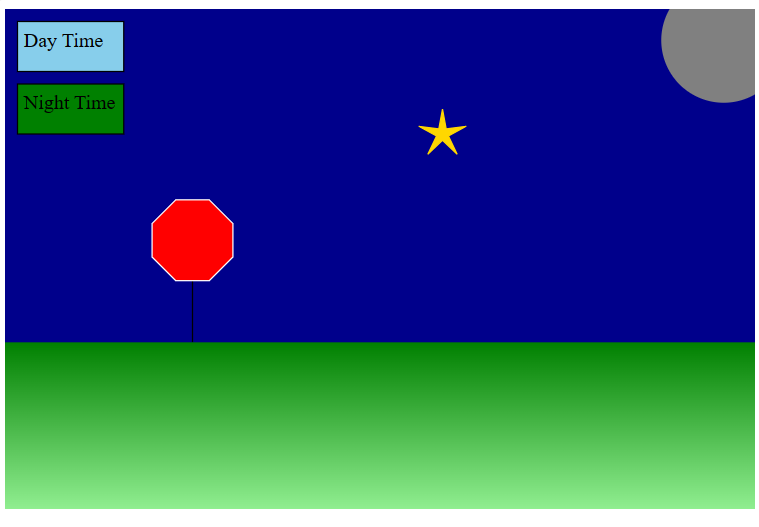

Linnk to GitHub Page: https://cehrensperger.github.io/a1-ghd3/

Technical Achievements Desription -- 12

The technical achievements I have made during this project are:

Enabling the random generation/placement of the polygons (pentagons) and rectangles.
    This is to represent a random placement of sprinkles on the ice cream cone. The
    random generation is done by taking a starting pentagon/rectangle and adding a 
    random amount of x and y displacement to it to generate another one. 

   

Enabling the user to move the ice cream cone with the arrow keys

Enabling the user to click and drag the svg (container box) and the individual sprinkles

Enabling the user to switch the colors of the sprinkles using spacebar

Enabling the user to remove the old sprinkles by clicking the Random Sprinkles button

Enabling the user to reset the page by clicking the Reset/Reload button

Design Achievements Description -- 12

The design achievements I made during this project are:

The design of using the required elements (lines, polygons, rectangles and circles) to create 
make an ice cream cone

Making an easy to use interface for the user

I also think allowing the user to move the different elements of the page is a good design
choice because it gives the user more choice, especially when placing the sprinkles

After adjusting the sprinkles manually: 

Using random placement of the rectangles and pentagons to make it look like spinkles

Cohesive theme between the svg container, the buttons, and the textual instructions 

Followed this color palette: https://www.color-hex.com/color-palette/660
to make the ice cream look more "realistic"

Giving the user the ability to move the entire svg (box container) felt like a fun addition
since it is kind of unexpected

