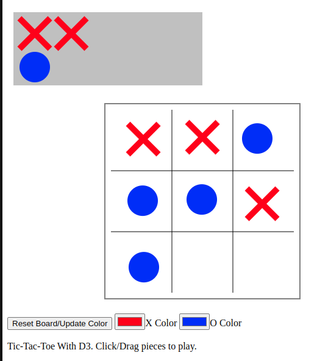
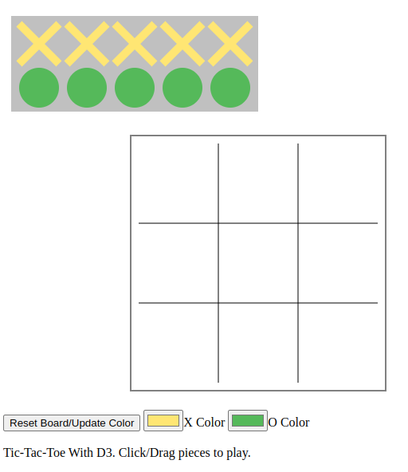

Assignment 1, Patrick Salisbury - Hello World: GitHub and d3  
===

https://pjsalisbury.github.io/a1-ghd3/

## Assignment Description
For this assignment, I created a simple tic-tac-toe game using d3. The pieces consist of circles and x-shaped polygons, and the gameplay board is defined using lines. There is a rectangle background behind the piece starting area as well as a rectangle around the gameplay board.

To play the game, the user can drag the x and o pieces to their respective places on the board. The idea is that players will take turns using the mouse to drag pieces. This feature was implemented using the d3.drag() functionality and some helper functions to update the position of the svg element as it is moved.

The color pickers can be used to change the colors of the pieces. Note that the colors will not update until the Reset Board/Update Color button is used, which as stated doubles as a board reset feature.

Note that I did use the vanilla HTML example from https://d3js.org/getting-started as a starting point for the assignment.

### Technical Achievements
- Interactive tic-tac-toe pieces using d3.drag()
- Reset board button that clears the svg and draws the pieces in their default configuration

### Design Achievements
- Visualization is a functioning tic-tac-toe game
- Color picker allows pieces to be set to any color of their choice
- Piece backdrop and board border add some organization to the game

