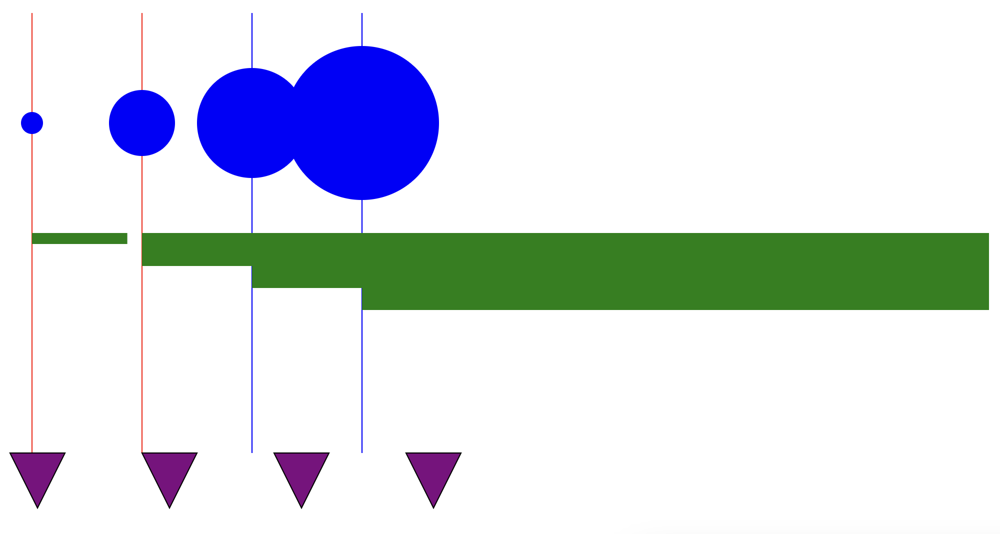
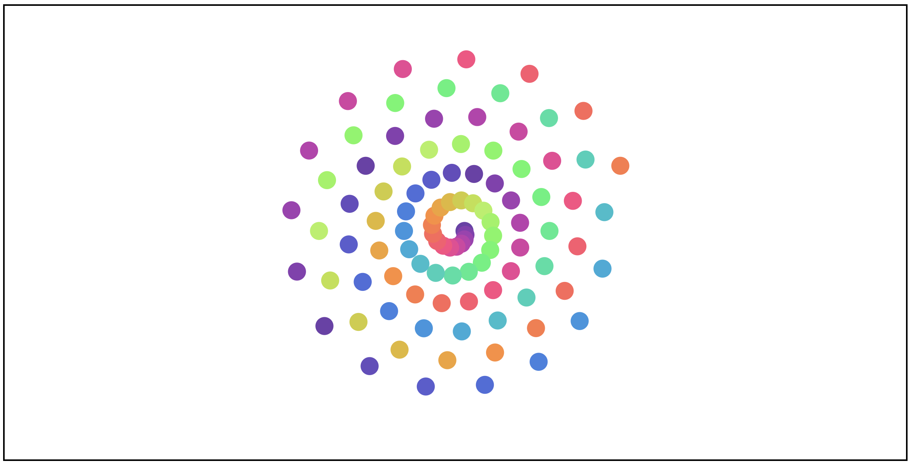

Assignment 1 - Hello World: GitHub and d3  
===
Additions: 

Link: http://huangrandy.github.io/a1-ghd3/index.html

I used a basic dataset of 4 numbers, starting at 10 and incrementing by 20 
I created circles, rectangles of different sizes based on the data index, lines with colors based on the data index, and triangle polygons filled with colors.


Design and Technical Achievements

I created a pannable/zoomable display for a spiral display of 50 circle points. I generated the spiral shape using function that generates it using a little bit of math. When hovering over the circles, the circle will become 1/2 transparent to indicate hover status, and you can also drag the circles around. The toughest part of the design was creating the spiral for the visual display, since I had to figure out how to generate the points for the spiral. I also had to figure out how to make the circles draggable, which was a bit tricky since I had to figure out how to make the circles draggable without making the entire svg move -- it was a bit easier after I looked at some examples online. The spiral was also a bit of a technical challenge, since I had to consult some math to figure out how to generate the points for the spiral.


GitHub Details
---

- Fork the GitHub Repository for Assignment 1. You now have a copy associated with your username.
- Make changes to index.html to fulfill the project requirements. 
- Make sure your "main" branch matches your "gh-pages" branch. See the GitHub Guides referenced above if you need help.
- Edit the README.md with a link to your gh-pages site "http://YourUsernameGoesHere.github.io/01-ghd3/index.html".

Submission Details
---
- To submit, make a [Pull Request](https://help.github.com/articles/using-pull-requests/) on the original repository.
- Note: name your pull request using the following scheme: 
```
a1-your Gh username-your first name-your lastname

```

Grades are on a 120 point scale. 
96 points will be graded for functionality: the program does what the assignment requests with an informative README. 

We will use Google Chrome to view submissions. 
Be sure to test your code there.

Below are some, but not necessarily all, of the key points we will consider during grading:

- Circles and Rectangles  
- Lines  
- Polygons  
- Different colors  
- README Quality
    - A description of what you have created. 1-2 screenshots are recommended for the README.  
    - A working link to the hosted files (usually the gh-pages 'live' url)  
    - Section for Technical and Design Achievements

Technical Achievement Desription -- 12  
Design Achievement Description -- 12

Remember, it is up to *you* to define what constitutes a technical and design achievements.
Be ambitious as these are designed to allow you to shape your learning.
These are the only way to move from B to A territory.

