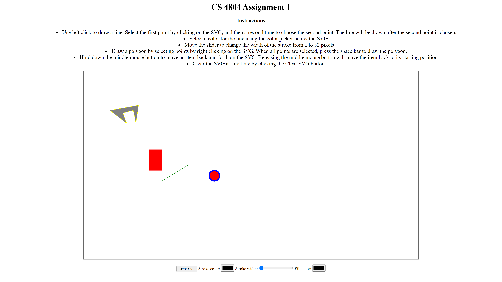
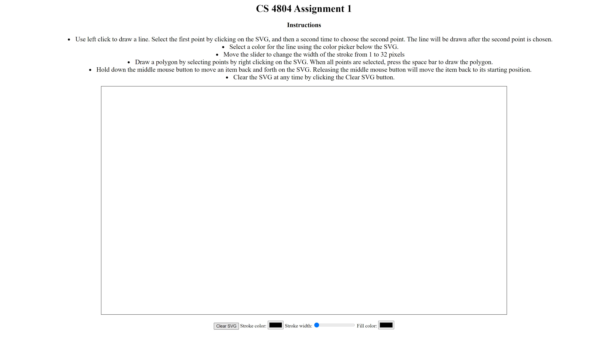
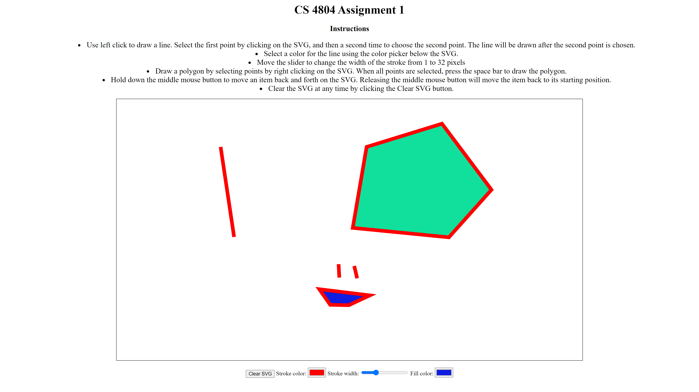

Assignment 1 - Hello World: GitHub and d3  
===
## Description
For this project, I created an environment where the user can draw lines and polygons to the SVG on the website. When the page initially loads, a line, rectangle, circle and polygon is added by default. The user can press the "Clear SVG" button to delete all shapes placed within the SVG. The user can left click on the SVG at two points to draw a line. The thickness of the line can be controlled by the stroke width slider below the SVG. This line will start at a size of one and grow to the selected size with a transition. This stroke size will also appear on the border of any polygons drawn on the SVG. Polygons can be drawn on the SVG by selecting at least two points using the right click button on the mouse. When the user has selected all the points, pressing the space bar will draw the polygon to the SVG. The fill color can be selected before pressing space to choose the fill color of the polygon. The user can hold down the middle mouse button on any shape in the SVG and the shape will animate back and forth over its original position on the x axis. Releasing the middle mouse button will move the shape back to its original position. 

## Technical Achievments
- The user is able to draw polygons and lines using their mouse on the SVG. Instructions to use this feature are located above the SVG on the webpage.
- The user can clear the SVG at any time using the Clear SVG button. 
- The user can select the stroke width of polygons and lines in the SVG

## Design Achievments
- A user controlled animation on all SVG contained elements was added, allowing the shapes to move back and forth as long as the middle mouse button is held on the shape. 
- Basic CSS was added to the webpage, including centering the elements and adding a border to the SVG. 
- The user can select the color of the line or polygon before drawing. 

## Screenshots
### Initial page

## Clear SVG

## Drawing with different colors

## Resources used
- [SVG Documentation](https://developer.mozilla.org/en-US/docs/Web/SVG)
- Professor Harrison's Loom Video (Uploaded to Slack)
- [D3.js Documentation](https://devdocs.io/d3~6/)