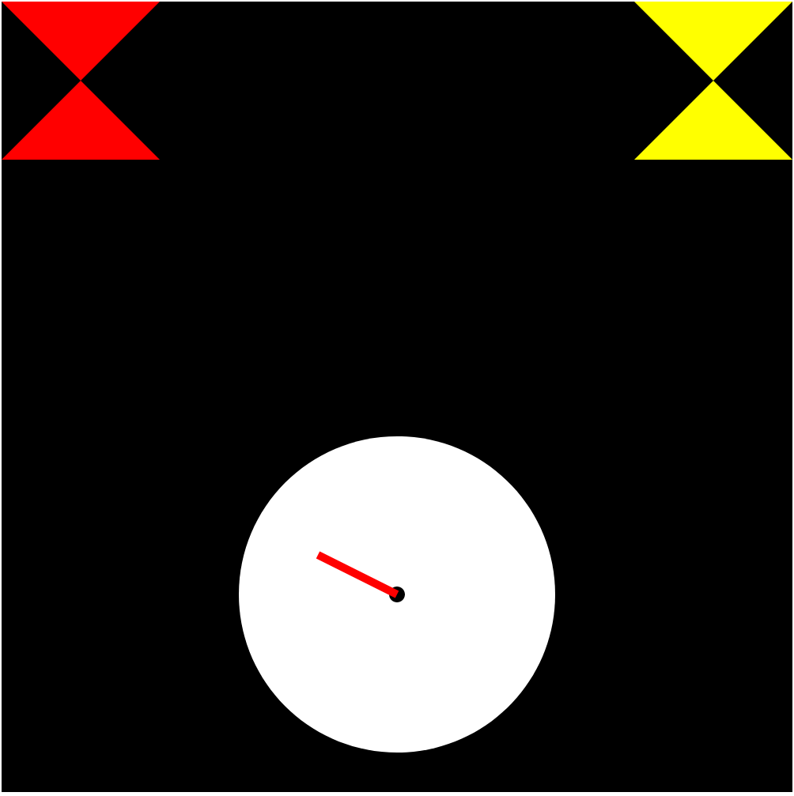

Resources Used:
 -https://www.youtube.com/playlist?list=PL6il2r9i3BqH9PmbOf5wA5E1wOG3FT22p
 -https://d3js.org/d3-transition/selecting
 -pregiven code
Description
    I made a diorama of a wall with a clock and two differently colored hanging lights that look like hourglasses. The clock is made up of two different elements, circles are used to differentiate it from the wall as well as the center point of the clock. Additionally 2 lines are used to represent the hour and minute hands of the clock. The wall is made up of a single black rectangle, while the lights are made of polygons. This also contains a animation of the clock falling down and bouncing once,
Technical Achievement Description
    Not only are all of the required graphic primitives in this page as shown in the previous description. I have also added an basic animation of the clock falling down and bouncing once. This was done by chaining together 3 different transition statements on every single object in the clock. The 1st step involved the y variable of every component increasing by 500. The second step was decreasing the current y variable by 200. Lastly, the third and final step was undoing the change of the second step.
Design Achievement Description
    I have made a diorama of a wall with a clock and two differently colored hanging lights, where the clock falls off the wall. This was actually inspired by the posters in my apartment, they ALWAYS fell down eventually with the exception of one on the right of my bed. The clock represents the time I spent learning the basics of d3 and reaquanting myself with javascript.
Screenshots

